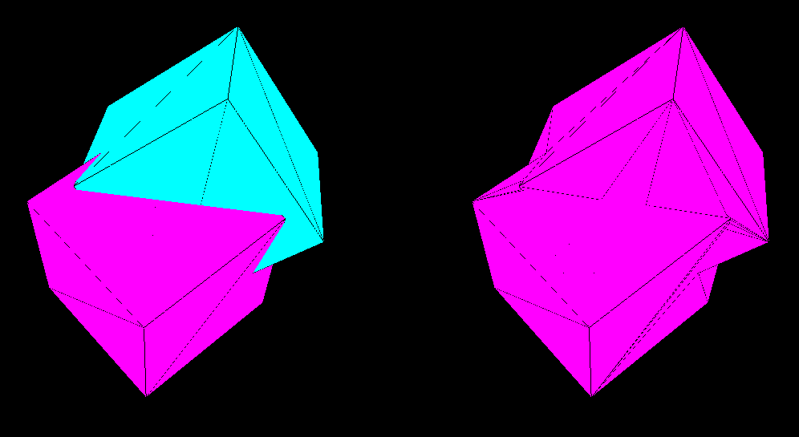

# ciCSG

A simple library for CSG (Constructive Solid Geometry) based on ofxCSG by [Lars Berg](https://github.com/larsberg/ofxCSG)
for [Cinder 0.9.0](http://libcinder.org). This is a work in progress and should be tested thoroughly before use in production.  Contributions welcome.

###Usage
Includes methods for Union, Intersection, and Difference.

It will take any ci::TriMeshRef as piece of geometry, and will work with loaded models as well as cinder geom objects.  Usage is straightforward.  After including the header:

```
#include "ciCSG.h"

...

TriMeshRef mesh0 = TriMesh::create(geom::Cube());
TriMeshRef mesh1 = TriMesh::create(geom::Sphere());
TriMeshRef resultMesh = TriMesh::create();

ciCSG::meshUnion(m0, m1, resultMesh);
ciCSG::meshDifference(m0, m1, resultMesh);
ciCSG::meshIntersection(m0, m1, resultMesh);
```

For more in depth information check out [ofxCSG](https://github.com/larsberg/ofxCSG).


